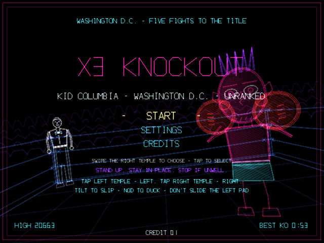
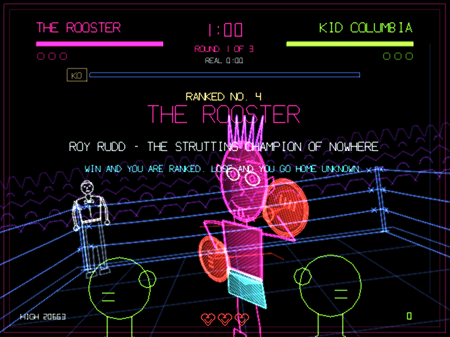

# X3 Knockout

An arcade boxing cabinet in the spirit of Nintendo's 1984 *Punch-Out!!* — cited here as the
design object; none of its names or trademarks reach the glass, the game speaks in its own names —
rebuilt for a pair of glasses you stand up in, the **RayNeo X3 Pro**. One boxer, **ROY "THE
ROOSTER" RUDD**, a glowing comic-book caricature 2.6 m in front of you in a ring of blue rope. He
telegraphs every punch with his eyes, his gloves, his crest and his feet; you slip, duck, block or
step; and you hit him back by tapping the temples of the glasses, because both hands at the
temples is a boxer's guard:

## Screenshots

<p>
  
  
</p>

> **LEFT temple = LEFT glove. RIGHT temple = RIGHT glove. Both inside 120 ms = the big one.**

All of it runs under the law this fork inherits from x3discs and keeps:

> **TIME MOVES ONLY WHEN YOU MOVE.**

— with the floor handed to the boxer's own state, so that the world hangs exactly when there is
something to read and runs when there is not. Stand still and his wind-up freezes with its future
drawn as a line to the point on your face it is aimed at. Move, and your move throws his punch.
His glove travels on the same clock (the owner's ruling, `docs/BOXER.md`): stand still and it
hangs a hand's width from your cheek until the fuse brings it.

> **STAND UP. STAY IN PLACE. STOP IF UNWELL.** The title says it and means it: you slip, duck and
> step with a real room that stays put. A step is 0.55 m of camera slide, not a cue to walk. It
> contains flashing lights — the telegraph flashes, the hit-stop white, the KO box — every one a
> single ramp, never a full-depth strobe. And **don't slide the left pad**: a slide on it is the
> system volume.

Kotlin + OpenGL ES 3, zero dependencies, zero permissions, no network. Package `com.x3knockout`.

**Status: prototype — one boxer, three rounds, playable end to end at the desk.** The fight, the
economy, the knockdowns and the count, the KO and the tally, the continue, the settings and the
credits are built; the boxer's 20 pose strips, the ring, the crowd and the referee are authored in
Blender and exported; five music tracks are in. The voice lines are scripted (`docs/BOXER.md` §9)
but **not rendered yet** — the game runs without them (the intro floors at 3 s, the corner's tip
is captioned, the referee's count is numerals and clicks). Everything on-head — the left pad on a
real temple, the slap that is the special, the dodge geometry against a real neck, whether the
hang feels like bullet time or a pause — is the owner's standing test, `docs/TEST.md` §2, and is
still owed.

## How it plays

- **The clock is your body.** Every frame the world gets `dt × timeScale`, where
  `timeScale = floor + (1 − floor) × clamp(motion + act)` and `motion` comes from the raw gyro and
  accelerometer magnitudes, not from a smoothed pose — the world stops when your head does. A held
  posture is not motion: lean over and stay there and the clock sits back down at the floor.
- **The floor is his state.** He circles at **0.35** while idle, so the fight never looks paused.
  The moment he winds up the floor snaps to the **hang** — 0.04 / 0.06 / 0.10 by difficulty, held
  for 1.2 / 0.8 / 0.5 real seconds — and the telegraph freezes: which eye, which glove, the crest,
  the feet. Then the **fuse** ramps the floor to 0.60 over 1.2 s and holds it there: he does not
  wait forever; the punch comes to you. The fuse keeps burning through the strike, so a glove you
  froze in flight arrives on its own. While he is open — recovering from a whiff, staggered,
  stunned — the floor is **0.12**: the opening is measured in your punches, not in seconds. His
  fall runs at 0.22; the referee's count runs the world at 0.
- **Your punches force the world to run.** A jab is a forced 0.28 s at full rate, the cross 0.36 s,
  the special 0.60 s. A **whiff** — into air or into his closed guard — extends the window by
  0.15 s and costs a heart; a **landed** punch is cut to its active frames and its recovery cancels
  into the next punch; a **COUNTER** thrown inside the perfect window is waived entirely — the world
  stays at the floor while you throw it. Four blind punches into his guard run three seconds of
  world time and lose four hearts; four that land cost under a second. Rhythm, not mashing.
- **Hit-stop.** A landed punch stops both clocks for 70 / 110 / 130 / 200 ms (jab / cross /
  counter / special) with the glove white-hot, his head outline white for two frames and the whole
  scene kicked 6 px away from the punch. The render loop never stops — only the clocks.
- **Head level = head shot, head down = body blow.** His body is below your eye line, so looking at
  it is a nod, and a nod of about 10° arms the body (hysteresis, so a combo cannot flip levels).
  The body is never covered by his gloves: a body blow lands through a closed guard and **opens**
  it for 0.6 s of world time; a second body blow inside that window staggers him. The guard
  re-closes on world time — on your own punches.
- **Every dodge is geometric, never a threshold.** A punch is aimed at where your collider was when
  the tell committed; whether it lands is decided by where the collider is at the contact frame.
  Off the line before the strike began = **CLEAN** (+50). On the line when it began, off it at
  contact = **PERFECT** (+300, hearts refilled, +3 meter) — a real reflex inside a strike whose
  moment *you* chose by completing his tell — and it opens a 0.6 s real-time **counter window**
  (0.8 EASY / 0.45 HARD) in which your next punch does double damage, adds +10 to the meter and
  costs no world time. Half in = **GLANCE**, half damage.
- **Hearts are the punch budget.** Three. A whiff costs one, a hit on you costs one, your knockdown
  costs all three; one comes back per second of *world* time with no punch in flight, all of them
  on a PERFECT and at the bell. At zero you are **WINDED** and cannot punch until one refills — a
  still player does not heal.
- **The KO meter is the cabinet's economy.** 0..30, pouring in at one point per 133 ms so a combo
  visibly fills it: +2 for the first hit of a sequence, +5 for every hit after, +10 for a counter,
  +3 / +1 for a PERFECT / CLEAN dodge; −1 blocked, −2 dodged, −8 / −12 when you are hit; reset on
  any knockdown. **LIT at 26** — the KO box flashes and the corner shouts. Then both temples inside
  120 ms is **the special**: the jab already in flight is upgraded in place, the meter is spent to
  4. On an open guard 35 damage; in a stagger a knockdown that he does not get up from; into a
  closed guard it does nothing but knock the guard open. A rhythm gate, not an ammo store.
- **Five attacks, five telegraphs, one cheap answer each and one fatal one:**

  | # | attack | the tell | cheap answer | fatal answer |
  |---|---|---|---|---|
  | 1 | **LEFT PECK** — jab to the head | left pupil white, left glove white-hot, a cluck | slip right (lean off the lit glove) | stand there: 8 |
  | 2 | **RIGHT PECK** — cross to the head | right pupil white, right glove white-hot, a higher cluck | slip left | stand there: 10 |
  | 3 | **RIGHT WING** — wide hook to the head | crest GOLD and fanned, eyes to slits, the boot plants (a stamp) | **duck** (PERFECT staggers him) | a slip: 15 + a stun; a block: crushed |
  | 4 | **LEFT WING** — low hook to the ribs | crest GOLD but drooped, the glove drops below the frame, a stamp then a whistle | **block** (a guard-counter: he is open, +150) | **duck into it: 18** |
  | 5 | **THE SUNRISE** — uppercut from below | he crows, crest WHITE and straight up, both pupils white, the glove rises from the bottom edge | any slip (PERFECT staggers him) | duck: 25; block: 25 (unblockable) |

  The eyes say jab or not-jab, the glove says which hand, the crest says hook (gold) or uppercut
  (white) and high (fanned) or low (drooped), the stamp says a hook is loading. Round 1 is the
  strut, round 2 the ruffle (shorter tells, feints), round 3 the cockfight (the 1-2, the double
  wing, a tracking uppercut that only a step or a slip begun inside the strike escapes). A RIGHT
  thrown over his incoming LEFT PECK before it lands stuns him for 0.6 s; a body blow wakes him.
- **Knockdowns and the count.** He goes down when his HP crosses two thirds, one third and zero
  (80 / 40 / 0 of NORMAL's 120), on a special landed in a stagger, or on a counter into a
  perfectly-countered uppercut. The fall is a story beat at 0.22; then the referee counts on the
  **real** clock — the only clock in the game the body does not own — and he rises at 4, 7 and 9,
  unless it was the special or the counter, in which case **KNOCKOUT**. Three in one round is a TKO;
  a fourth in the fight is always a KO. At 0 HP *you* drop: the view sinks, the count runs, and you
  rise by **eight alternated left / right taps** before ten. The third knockdown of you is the
  loss — `GAME OVER`, `INSERT COIN TO CONTINUE` (same fight, round 1, score 0, nine seconds).
- **Three rounds of 60 world seconds** — the round clock counts down on the plate and visibly stops
  when you do. Three strokes of the bell to start, one to end, three fast for a KO, a wood-block
  clapper on the last ten seconds. A real-time cap of 3:00 per round, past which the floor holds
  0.35 (you may stand still; not forever). Between rounds the ropes slide you to **THE CORNER**
  (2.2 s): +30 HP, hearts back, and one sentence chosen from what hit you most. No KO by the end of
  round 3 is `TIME - NO DECISION`, which is a loss: only a knockout wins.
- **The score teaches the fight.** Head punch 100, body blow 150, ×2 in a stagger; CLEAN 50,
  PERFECT 300, COUNTER 300, guard-counter 150, a step that clears a double 400, the special 1000,
  a knockdown 2000, the KO 5000; a multiplier ×1…×4 from consecutive dodges without being hit,
  shown as the rope glow. At the KO, **TIME BONUS = 10 000 × max(0, 1 − realSeconds / 180)** — the
  only place real time is judged. The law gives you all the time you want; the bonus asks what you
  did with it. The whole run × 0.75 / 1.0 / 1.5 by difficulty. Records: `HIGH`, `BEST KO` (fastest
  real time to a knockout), `FIGHTS`.

| | EASY | NORMAL | HARD |
|---|---|---|---|
| the hang | 1.2 s | 0.8 s | 0.5 s |
| the deep floor | 0.04 | 0.06 | 0.10 |
| the counter window | 0.8 s | 0.6 s | 0.45 s |
| his tells | × 1.2 | × 1.0 | × 0.8 |
| his HP | 100 | 120 | 140 |
| damage on you | × 0.8 | × 1.0 | × 1.2 |
| feints from | round 3 | round 2 | round 1 |

EASY until the first knockdown has ever been scored on the device — the suite's rule.

## Controls: two temple pads and the head

| Input | In the fight | Title / cards / game over | Settings |
|---|---|---|---|
| **LEFT pad tap** | **LEFT PUNCH** (rise tap during your count) | — (the left pad is fight-only) | — |
| **RIGHT pad tap** | **RIGHT PUNCH** (rise tap during your count) | insert coin · skip the intro / the tally · continue | adjust the row; `RESET` / `QUIT` arm then confirm |
| both pads inside 120 ms | **THE SPECIAL** if the meter is lit, else a 1-2 | — | — |
| right pad swipe DOWN, held | **GUARD** until the finger lifts (a flick pops it for 0.5 s) | — | selection down (one step per gesture) |
| right pad swipe LEFT / RIGHT | **STEP** — 0.35 s forced at full rate, 0.55 m of slide, invulnerable in flight | — | adjust the value |
| right pad swipe UP | the special with `LEFT PAD` OFF, else a click | — | selection up |
| right pad double-tap | nothing (gloves up: no menus by tapping) | settings | close |
| right pad triple-tap | nothing | re-centre + rest posture | — |
| **tilt the head** | **SLIP** — the eye and the collider move sideways, 0.55 m at full lean | — | — |
| **nod** | **AIM LOW** at ~10° (every punch is a body blow); **DUCK** at 0.6 of a full nod | — | — |
| a real sidestep | the same **STEP**, felt by the accelerometer | — | — |

**The left pad is tap only.** Every earlier X3 app dropped it as "the system volume pad". Measured
for this game (`docs/INPUT_LEFTPAD.md`): a single tap on the left temple reaches the app and
triggers nothing system-side; a **slide** changes the volume; a **double- or triple-tap** is
classified by RayNeo's gesture service into a system media key. So the app holds the media-button
session while it is in front and swallows those keys — a jab-jab must not pause whatever you were
listening to — and a left slide, hold or cancel is consumed and ignored. Left vs right is decided
by the *touch* stream, which carries the kernel device name (`cyttsp6_mt` = left, `cyttsp5_mt` =
right); the keys the service injects (`BUTTON_A` for a tap, one `BACK` for a double-tap) carry no
device and only ever corroborate a tap already counted. One more thing the desk measured: this
OS keeps one live touch stream per display, so a two-handed slap arrives as two *cancels* and no
lift — `MainActivity` recovers a short, still gesture cancelled by the other pad as the tap it
was, and every overlap ordering yields both punches with a `PAIR ms=` of 34–51.

**`LEFT PAD` OFF** is the fallback that ships in the same build: right-pad taps alternate hands by
rhythm (the lit glove says which) and swipe UP is the special. Fully playable one-handed.

In a fight the settings are one `BACK` with no finger on a pad away (or the corner); off the arena
a double-tap. D-pad keys mirror the right pad for desk testing (`DPAD_CENTER` = right punch,
`DPAD_DOWN` held = guard, `DPAD_UP` = swipe up, `DPAD_LEFT/RIGHT` = step). **There is no key for
the left pad, by design: a key can never name a pad.**

## Lean, duck, step: the inferred body

The glasses know the head's tilt and nothing about where the body went, so the body is inferred
the way a spine works (`head/MotionTracker.kt`, measured on the owner's head — `docs/MOTION.md`):

```
lean:  dead 4°, then 0.55 m of sideways shift by 16° of roll (DODGE SENSE MEDIUM; 22° LOW, 12° HIGH)
duck:  0.42 m of drop by 22° of nod (29° LOW, 16° HIGH); AIM LOW at 0.35 of it (~10°), DUCK at 0.6
step:  a felt sidestep (four gates: not turning, not leaning, not nodding, a real push) or a swipe —
       0.55 m out over 0.35 s, back over 0.75 s; blanked for 150 ms after any pad touch
collider: a capsule from 12 cm above the eye to 95 cm below it, half-width 26 cm
```

Roll and pitch come from gravity, drift-free, referenced to a rest posture taken on the coin tap
and re-declared at every round card while the head is still (twenty taps on one temple push the
frame on the nose). The camera moves with all three, horizon counter-rolled, so you see yourself
dodge: the world slides behind your fixed gloves. Nothing in the moveset is survivable only by a
body the glasses cannot feel — every attack has a pad answer (guard or step) as well as a posture
one. A slap on the temple is 3 m/s² of acceleration, which is why steps are blanked around pad
touches and why the corner says "Don't punch and run" if three body steps are rejected that way.

## The two clocks

Every timer in the game is on exactly one of two clocks; `docs/DESIGN.md` §2.9 is the audit list
and `TwoClocksTest` proves the wiring on the real engine.

- **World time (`wdt`)** — his strips in the tell, the strike and the recover; his guard's
  re-close and open windows; the stagger and its extension; the feints; the round clock; heart
  refill; his circling and taunts; the pattern's waits. Everything that can hurt you.
- **Real time (`dt`)** — the hang and the fuse (they bound the read, so they must run while the
  read is still); every forced timer (your punch, the hit-stop, the fall, the count, the step, the
  corner); the counter window; the meter's pour; the HUD and its flashes; the crowd's loudness (it
  is the rate meter); the bells, the announcer, the corner's sentence, the referee's count; the
  3:00 cap; music. Everything that belongs to the player, the referee or the story.

Get one hostile timer onto the wrong clock and the promise breaks; get one caption onto the wrong
clock and the story freezes while the player stands still thinking. `Clock` is the only thing
allowed to decide what a second is.

## Settings (double-tap on the right pad)

`MUSIC` · `VOLUME` (0–10) · `VOICE` · `DIFFICULTY` · `DODGE SENSE` (LOW / MEDIUM / HIGH — the full
duck and lean angles) · `STEP SENSE` · `LEFT PAD` (ON / OFF) · `CAPTIONS` (AUTO = the answer word
for the first two of each attack / ON / OFF) · `MOTION LAB` · `CREDITS` · `RESET SETTINGS` · `QUIT`
(title and game over only). With `MOTION LAB` on: `TIME FLOOR` (3 / 5 / 8 / 12 / 20 %, overriding
the idle floor), `HANG` (0.5 / 0.8 / 1.2 s), `PITCH COMP` (0 / 0.5 / 0.7 — how much of a nod the
view un-pitches during a duck; 0 until the owner rules) and `DRILL` (OFF / PECK L / PECK R / WING R
/ WING L / SUNRISE / ALL — he throws only that attack every 2.5 world seconds, no damage either
way: the standing test's instrument); debug builds add `KNEE` (A / B). Nine rows at a time.

The lab plate draws every body signal live on the right of the plate — the rate, the motion
scalar, the floor in force, the hang and the fuse, roll and pitch, the step counts, the last pad
and key event with its device name — and the 20 Hz raw recorder writes `cache/motion.log`:

```sh
adb shell run-as com.x3knockout cat cache/motion.log > motion.log
tools/.venv/bin/python tools/analyze_motion.py motion.log
```

Records survive `RESET SETTINGS`; a debug launch never writes them.

## Telemetry

Everything the review process reads goes to logcat under the tag `X3Knockout`: a 10 Hz `CLK`
line (`|w| m act rate floor step blank knee [forced=]`), a 5 Hz `MOTION` line, a 5 Hz `VERIFY`
pair (his phase and strip:frame, HP, guard, the floor in force, the hang and the fuse, the aim
point vs the capsule; your HP, hearts, meter, lean, duck, body), one `PAD` line per touch event on
either pad with its device name and one `KEY` line per key with its device and whether it was an
echo, and the event lines: `PUNCH` / `PAIR ms=` / `SPECIAL` / `TELL` / `FUSE` / `STRIKE` /
`STAGGER` / `GUARD` / `KNOCKDOWN` / `RISE` / `KO` / `TKO` / `COUNT` / `ROUND` / `BELL` / `CORNER` /
`NO DECISION` / `SCORE` / `GAME OVER` / `CONTINUE` / `METER` / `MENU` / `HIM …` (the boxer's own
branch, stall, stun and drill lines) / `EVENT …`, plus `fps= boxer= static= stream= hud= ts=` once
a second and `surface: maxLine=` once. Logcat's ring holds about a minute at that rate: stream
`adb logcat -s X3Knockout` to a file for anything longer than a round.

## Build and install

Requires JDK 17, the Android command-line tools (`sdk.dir` in `local.properties`) and the bundled
Gradle wrapper (Gradle 8.9 / AGP 8.7.3 / Kotlin 2.0.21; compileSdk 35, minSdk 29). Several agents
share this checkout, so the build is serialised through one script — never `./gradlew` directly:

```sh
cd x3knockout
tools/gbuild.sh assembleDebug                      # the APK
tools/gbuild.sh testDebugUnitTest                  # 47 JVM tests: BoxerTest, ClockTest, StripAssetTest,
                                                   #   StripPlayerTest, StripSetTest, TwoClocksTest
export ANDROID_SERIAL=A06B4A96A733283              # the glasses (the owner's phone is often attached too)
adb install -r app/build/outputs/apk/debug/app-debug.apk
adb shell am start -n com.x3knockout/.MainActivity
```

The app declares itself to the RayNeo launcher (`com.rayneo.mercury.app`, category
`com.rayneo.intent.category.AR_APP`) and renders a 1280×480 side-by-side surface, the same image
to both eyes. The left eye is the left 640 px of a screenshot:

```sh
adb exec-out screencap -p > shot.png
tools/.venv/bin/python tools/eye.py shot.png eye.png       # eye.py in out [zoom]
```

Never `am force-stop` it: the Mercury drawer drops force-stopped apps. Quit through the menu.

### The desk harness

Debuggable builds drop straight into a round and never write records:

```sh
adb shell am start -n com.x3knockout/.MainActivity -f 0x10008000 \
  --ei round 1 --ef floor 1.0 --ei hp 70 --es drill wing_r --es script counter
adb shell input keyevent 96                         # a RIGHT-pad tap (a punch; the coin on the title)
adb shell input keyevent 4                          # BACK = a double-tap: settings open / close
adb shell input swipe 900 240 600 240 150           # step left
adb shell input swipe 800 150 800 380 1500          # guard, held
adb shell input swipe 800 380 800 150 120           # swipe up
```

`round` starts the fight at that round, `floor` overrides every floor (1.0 runs the world at full
rate on a still desk; 0.0 freezes it), `hp` sets his HP at the bell, `drill` makes him throw one
attack every 2.5 world seconds with no damage either way, and `script counter` throws a scripted
body blow 0.6 s after the bell and a right hand as a COUNTER into the opening it makes. The
activity is `singleTask`, so a second `am start` on a live process is delivered to the running
instance and its extras ignored; the `-f 0x10008000` (`NEW_TASK | CLEAR_TASK`) recreates it with
the new extras without a force-stop. **There is no way to inject a LEFT-pad tap from adb** — the
only thing that names a pad is a touch on it — so the left pad is tested with a finger, or at the
desk with `tools/uhidpad.py`, which registers two virtual HID touch screens *named*
`cyttsp6_mt` / `cyttsp5_mt` through `adb shell hid -` and proves the app's attribution, the pair
timing and the two-cancel slap (not the pad hardware).

### The assets

The boxer is a rig in `blender/assets/boxer.py` — joint empties, stretchy IK arms, six mouths, four
eyes, a five-spike crest — baked to one keyframe per object per frame and exported by
`blender/export_strokes.py` into `app/src/main/assets/models/boxer.json` + `boxer.x3s`: 32 tinted
parts, 7 markers, 20 strips, 196 frames, no frame over 700 stroke segments. The ring, the crowd
and the referee are `ring.py` / `crowd.py` / `referee.py` beside it.

```sh
blender -b -noaudio --factory-startup --python-exit-code 3 --python blender/export_strokes.py \
  -- blender/assets/boxer.py app/src/main/assets/models/boxer.json
tools/.venv/bin/python tools/strip_sheet.py app/src/main/assets/models/boxer.x3s 'sheet_<strip>.png'
blender -b -noaudio --factory-startup --python blender/render_strips.py -- --out DIR --every 3 wing_r
```

`strip_sheet.py` is the engine-exact preview (the same camera, projection, tint gains and additive
passes as the glasses); `render_strips.py` is Blender's own render of the rig. `StripAssetTest`
pins the strip table — names, counts, loop flags, events, the 196 total — against the shipped file.

## The look, and the workarounds

The waveguide shows glowing strokes on the real room: black is transparent, so "dark" means a
black ground and fully saturated hues with small white-hot cores, never grey, never washed.
Additive blending and no depth buffer: nothing occludes, everything sums, and brighter reads as
nearer — which is the whole incoming cue. The glove that is coming goes white-hot for its tell and
grows on the extend; the closed guard is brighter because its gloves overlap the jaw; exactly one
thing is white at a time. The boxer is a 2D stroke sprite, billboarded, 1.9 m tall, with the
caricature's secondary motion (the crest's droop with damage, the head snap on a hit, the stagger
wobble, the squash) computed per segment on the CPU, and the crowd is three tiered rows of
authored-LOD silhouettes swaying with the rate. Everything presents at 60 Hz, head-tracked, on a
processor that would not survive a triangle: a hit-stop stops the clocks, never the render loop.

## Music and voices

Five tracks by Kevin MacLeod (incompetech.com), **Creative Commons Attribution 4.0**, re-encoded
from the source MP3s to Opus in an Ogg container at 88 kbps for size and gapless looping:

```text
"Blue Ska", "Rollin at 5", "The Cannery", "Past the Edge", "Mighty and Meek"
Kevin MacLeod (incompetech.com)
Licensed under Creative Commons: By Attribution 4.0
http://creativecommons.org/licenses/by/4.0/
```

A ska horn section on the title, trumpet and trombone through the fight, something meaner for
round three, 44 BPM of nothing much for the count, and a fanfare slightly too pleased with itself
for the win — cut, never crossfaded, at the bell, the knockdown and the KO. The full credit block
per track is in `docs/MUSIC.md` and on the in-game CREDITS page verbatim.

The voice lines — the announcer, the referee's count, the corner's one sentence per rest, the
crowd, and the Rooster's crow that *is* the uppercut's tell — are written in `docs/BOXER.md` §9
and the bus that plays them (`audio/Voice.kt`, two tracks, urgent lines preempting, late lines
dropped) is on disk; the clips are not rendered in this build, and `assets/voice` is absent. The
SFX bank is synthesised at runtime.

## Documents

`docs/DESIGN.md` (the design, the verbs, the time law, the rules, the look, the HUD, the audio,
the settings, the telemetry, the comfort rules, and what could go wrong on-head) ·
`docs/BOXER.md` (the one boxer: the caricature, the moveset, the guard, the pattern, the strips,
the lines) · `docs/MOTION.md` (the body, measured) · `docs/INPUT_LEFTPAD.md` (the left pad,
measured) · `docs/TEST.md` (what adb can verify alone; the owner's standing tests in order) ·
`docs/MUSIC.md` (the licences).

tropicalstream · no network, no permissions.
